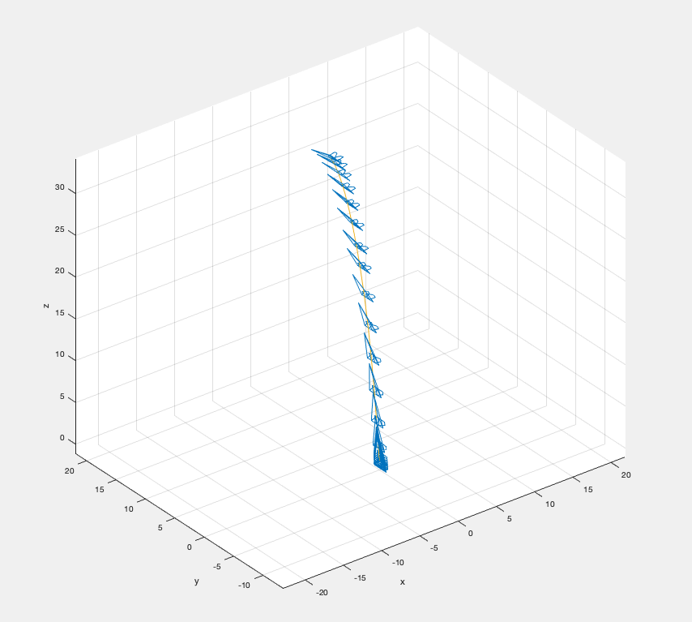

# Flight visualizer for OpenRocket

## How to prepare flight data

This simulator uses Euler Angle (Z-Y-X, Tait-Bryan angle, Psi-Theta-Phi).
In OpenRocket, export Time, Altitude(=z), North(=x), East(=y), Zenith(=theta), and Azimuth(=psi). Psi is associated Azimuth, whereas Theta is equivalent to Zenith.


Format the CSV to the following columns. Note that Psi and Theta is Radians. The export from OpenRocket is Degrees. You need to convert it manually. Also, the header must be coordinated, since it's used in the script (e.g., "time" must not be "Time").
```
time,z,y,x,psi,theta
0,0,0,0,0,1.466076572
0.01,0,0,0,0,1.466076572
0.02,0,0,0,0,1.466076572
0.03,0,0,0,0,1.466076572
0.04,0,0,0,0,1.466076572
...
```
Run the script as follows.
```
> main
```




